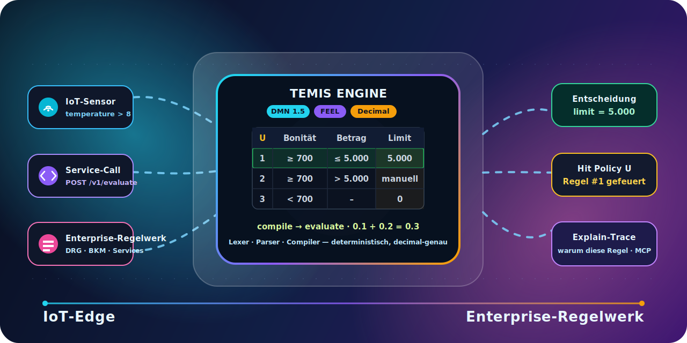
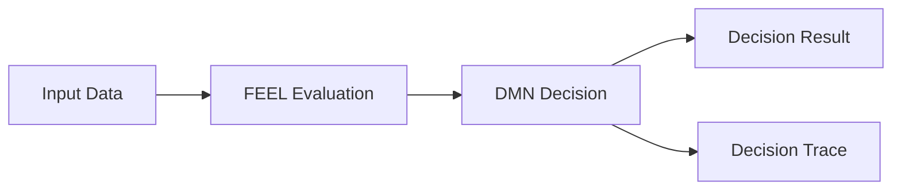

# Temis

**DMN decisions. Native Go. No magic.**

Temis is a lightweight DMN 1.5 decision engine written in Go. It makes business rules executable, testable, and traceable without hiding decision logic behind application code.



## Why Temis?

Business decisions should be explicit. Temis keeps decision logic close to the DMN model and provides a small runtime for evaluating rules from Go applications or service interfaces.

The project is intentionally scoped as a decision engine. It executes DMN decisions; it is not a workflow or process orchestration engine.

## Features

Implemented features include:

- DMN 1.5 decision execution, with namespace-tolerant loading for DMN 1.3/1.4/1.5 XML.
- FEEL expression evaluation with decimal numbers, temporal values, lists, contexts, ranges, filters, projections, comprehensions, quantifiers and built-in functions.
- Decision table support, including unary tests and hit policies U, A, F, R, C, P and O.
- Boxed expressions, BKMs, DRG chaining and Decision Services.
- Embeddable Go library through the public `dmn` package.
- HTTP API and embedded `temisd` service.
- gRPC/Connect API on the same service runtime.
- Optional decision traces through `dmn.WithTrace()` and the service `explain` flag.
- Web-based DMN modeler served by `temisd` for editing standard DMN XML.
- MCP integration as a thin adapter over the same decision engine, available through `temis-mcp` and the optional `temisd` `/mcp` endpoint.
- Git-backed model loading and proposal workflows for DMN XML.
- Optional clio audit sink and `temis-reaudit` replay tool for reproducible decision logs.

## Quick start

### Go library

```go
package main

import (
    "context"
    "fmt"
    "os"

    "github.com/pblumer/temis/dmn"
)

func main() {
    ctx := context.Background()

    xmlBytes, err := os.ReadFile("dmn/testdata/models/dish_15.dmn")
    if err != nil {
        panic(err)
    }

    eng := dmn.New()
    defs, diags, err := eng.Compile(ctx, xmlBytes)
    if err != nil {
        panic(err)
    }
    if diags.HasErrors() {
        panic(diags)
    }

    decision, err := defs.Decision("Dish")
    if err != nil {
        panic(err)
    }

    result, err := decision.Evaluate(ctx, dmn.Input{
        "Season":      "Winter",
        "Guest Count": 8,
    }, dmn.WithTrace())
    if err != nil {
        panic(err)
    }

    fmt.Println(result.Outputs)
    fmt.Println(result.Trace)
}
```

For a self-contained runnable example with inline DMN XML, see `dmn/example_test.go`.

### HTTP service

```sh
go run ./cmd/temisd -addr :8080
```

Upload a model and evaluate a decision:

```sh
curl --data-binary @dmn/testdata/models/dish_15.dmn \
  -H 'Content-Type: application/xml' \
  http://localhost:8080/v1/models

curl -X POST http://localhost:8080/v1/evaluate \
  -H 'Content-Type: application/json' \
  -d "{
    \"xml\": $(jq -Rs . < dmn/testdata/models/dish_15.dmn),
    \"decision\": \"Dish\",
    \"input\": {\"Season\": \"Winter\", \"Guest Count\": 8},
    \"explain\": true
  }"
```

## Concepts

- **Decision**: a compiled DMN decision selected by ID or name and evaluated against input data.
- **Input data**: the caller-provided context (`dmn.Input`) that maps DMN input names to Go values.
- **FEEL expression**: the DMN expression language used in literal expressions, table inputs, table outputs and boxed expressions.
- **Decision table**: a tabular DMN decision with input clauses, output clauses, rules and a hit policy.
- **Result**: the evaluated output of the requested decision plus intermediate decision values and diagnostics.
- **Trace**: an optional structured explanation that records which table inputs were tested and which rules matched. Traces are only produced when requested.

## Architecture



The public library follows a two-phase model:

1. `Engine.Compile(ctx, xml)` parses and compiles standard DMN XML into immutable definitions.
2. `CompiledDecision.Evaluate(ctx, input, opts...)` evaluates a selected decision repeatedly and safely from application code.

The service adapters (`temisd`, gRPC/Connect and MCP) call the same `dmn` package rather than a separate execution path.

## Usage

### Go library usage

```go
eng := dmn.New()
defs, diags, err := eng.Compile(ctx, xmlBytes)
if err != nil || diags.HasErrors() {
    // handle malformed XML or per-decision diagnostics
}

dec, err := defs.Decision("Dish")
if err != nil {
    // handle unknown decision
}

res, err := dec.Evaluate(ctx, dmn.Input{
    "Season":      "Winter",
    "Guest Count": 8,
}, dmn.WithStrictInput())
if err != nil {
    // handle input or evaluation error
}

fmt.Println(res.Outputs["Dish"])
```

### CLI and service usage

Temis ships several binaries:

- `temisd`: HTTP, gRPC/Connect, embedded modeler, OpenAPI documentation and optional co-located MCP endpoint.
- `temis-mcp`: MCP server over stdio or HTTP.
- `temis-reaudit`: replay/re-audit tool for clio decision logs.
- `temis-clio-worker`: optional event-driven bridge that consumes clio command events and writes evaluated results back to clio.

Common commands:

```sh
go run ./cmd/temisd -addr :8080
go run ./cmd/temis-mcp
go run ./cmd/temis-mcp -http :8081
go run ./cmd/temis-reaudit -models ./models -clio-url http://127.0.0.1:3000 -clio-token kid.secret
```

### HTTP usage

Core endpoints are documented in `docs/40-api-contract.md` and served by `temisd` at `/docs`:

- `POST /v1/models`
- `GET /v1/models`
- `GET /v1/models/{id}`
- `GET /v1/models/{id}/xml`
- `POST /v1/models/{id}/evaluate`
- `POST /v1/models/{id}/evaluate-graph`
- `POST /v1/evaluate`
- `GET /v1/status`
- `GET /healthz` and `GET /readyz`

### gRPC usage

The gRPC/Connect service is defined in `proto/dmn/v1/engine.proto`. It supports `Compile`, `Evaluate` and `EvaluateBatch` over the same engine and model cache used by the HTTP service.

### Docker usage

```sh
docker build --build-arg VERSION=dev -t temisd:dev .
docker run --rm -p 8080:8080 temisd:dev
```

Released images are published as `ghcr.io/pblumer/temis/temisd` when the release workflow runs.

## Development

Requirements:

- Go 1.23 or newer.
- Node.js/npm for the embedded web modeler build.
- Optional: `golangci-lint`, `buf` and Playwright browsers for the full local CI gate.

```sh
go build ./...
go test ./...
go vet ./...
make verify
make web-check
make web
```

Useful Make targets:

- `make build`: compile all Go packages and binaries.
- `make test`: run Go tests with the race detector.
- `make vet`: run `go vet`.
- `make lint`: run `golangci-lint` when installed; otherwise prints a skip message.
- `make web-check`: type-check the web modeler.
- `make web`: rebuild the FEEL WASM validator and Vite frontend.
- `make verify`: full local/CI gate.

## Project status

The public `dmn` package is treated as the SemVer-stable v1 API surface. The core engine, FEEL runtime, decision tables, service adapters, traces, modeler integration and operational APIs are implemented and covered by tests.

Areas that remain intentionally more cautious:

- The project continues to expand conformance coverage against the official DMN TCK corpus.
- The web modeler and flow tooling are practical integration surfaces, but the DMN XML contract remains the stable interchange format.
- MCP and LLM-assisted modeling are integration adapters, not the primary positioning of the engine.

See `docs/20-roadmap.md` for the detailed work-package status and `docs/40-api-contract.md` for the stable API contract.

## Documentation

| File | Purpose |
|---|---|
| `docs/00-overview.md` | Project charter, decisions and glossary. |
| `docs/10-architecture.md` | Package structure and compile/evaluate pipeline. |
| `docs/20-roadmap.md` | Work packages and implementation status. |
| `docs/30-feel-spec.md` | FEEL implementation notes. |
| `docs/40-api-contract.md` | Go, HTTP and gRPC API contract. |
| `docs/50-testing-strategy.md` | Test strategy, fuzzing, benchmarks and TCK approach. |
| `docs/70-integration-guide.md` | Library, service and modeler integration guide. |
| `docs/80-clio-decision-log.md` | Optional clio audit and re-audit integration. |
| `docs/90-decision-organization.md` | Decision organization for larger rule repositories. |
| `docs/adr/` | Architecture Decision Records. |

## License

See [LICENSE](LICENSE).
